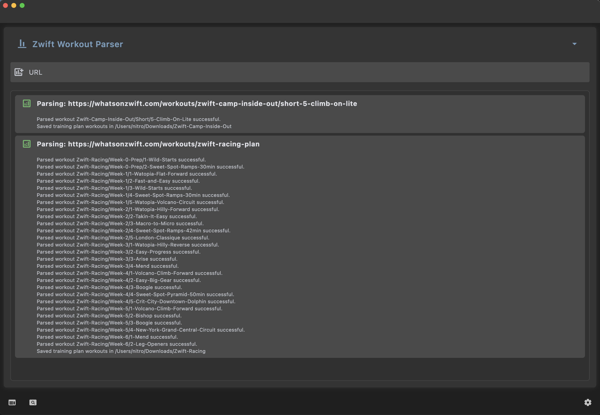
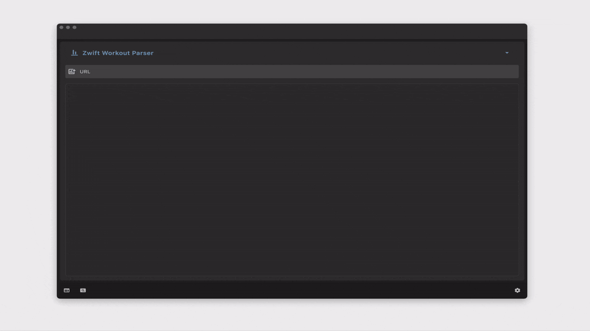

# ZWP | Zwift-Workouts-Parser - GUI

 

You want to ride workouts instead of worrying about installing python and cloning git repositories ?
I completely understand, thats the reason i created a GUI Version of zwift-workouts-parser.
More time to ride workouts. :-)

Parse workouts from https://whatsonzwift.com and use it in Zwift ( if you want to try a single workout from a training plan without the need to start it or in your favorite riding software which can import *.zwo workout files)

[Download latest release here](https://github.com/octo-org/octo-repo/releases/latest).

This project is possible thanks to [zwift_workouts_parser](https://github.com/alexshpunt/zwift_workouts_parser) !

# Installation

Simply [download](https://github.com/NiTRoeSE/zwift-workouts-parser-gui/releases/latest). the latest release for macos or windows and run it.